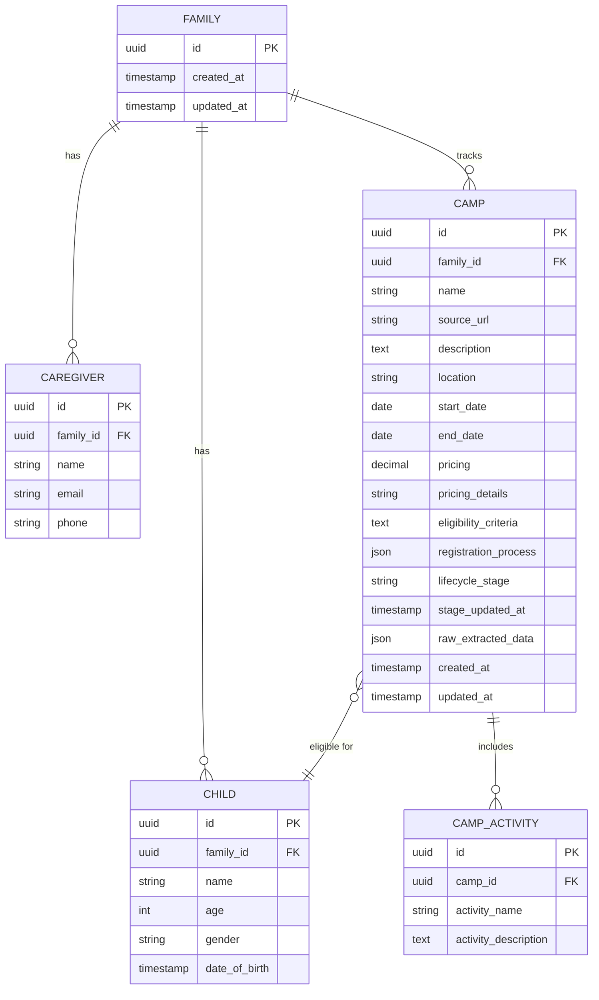

# ✨ Summer Schedule Planner: Agentic Family Logistics Management System

## Overview

Build an intelligent summer schedule planner application that helps busy parents manage family logistics for summer camps and activities. The system combines an agentic user interface powered by CopilotKit with backend workflow orchestration via Vercel Workflows, providing intelligent automation for camp discovery, registration tracking, and schedule visualization.

**Tech Stack:**
- Frontend: React + CopilotKit (agentic UI framework)
- Backend: Vercel Workflows (workflow orchestration)
- AI: LLM-powered web scraping and content summarization

## Problem Statement

Parents face significant cognitive overhead managing summer activities for multiple children:
- **Information Overload:** Summer camp websites have inconsistent structures and varying registration processes
- **Coordination Complexity:** Tracking multiple camps across different lifecycle stages (considering → applied → registered)
- **Timeline Management:** Coordinating registration deadlines, payment schedules, and activity dates for multiple children
- **Decision Fatigue:** Comparing camp options across dimensions (dates, locations, pricing, activities, eligibility)

**Current State:** Parents manually browse camp websites, copy information into spreadsheets, set calendar reminders, and juggle email threads with various organizations.

**Desired State:** An intelligent assistant that ingests camp information, tracks application lifecycle, and visualizes schedules—allowing parents to focus on decision-making rather than data entry.

## Proposed Solution

A four-component agentic application that guides parents through the summer planning journey:

### 1. **Family Profile Manager**
Centralized family context for personalized recommendations
- Caregiver information (names, contact details)
- Child profiles (name, age, gender) for eligibility filtering
- Preferences and constraints

### 2. **Camp Information Ingestor**
AI-powered web scraping and summarization
- URL-based camp page ingestion
- Structured data extraction (dates, locations, pricing, activities, eligibility)
- Registration process analysis (forms, email, phone, pre-registration options)
- Automatic summarization with LLM

### 3. **Camp Lifecycle Tracker**
Kanban-style camp management
- Four lifecycle stages:
  - 🤔 **Considering:** Camps under evaluation
  - 📝 **Applied:** Applications submitted, awaiting response
  - ✅ **Registered:** Confirmed registrations
  - 📦 **Archived:** Past camps or rejected options
- Drag-and-drop stage transitions
- Rich camp cards with extracted information

### 4. **Calendar Visualization**
Timeline view of active camps
- Color-coded by lifecycle stage
- Multi-child view with visual differentiation
- Conflict detection for overlapping dates
- Integration with camp schedule details

## Technical Approach

### Architecture

```
┌─────────────────────────────────────────────────────────────┐
│                     Frontend (Next.js + React)               │
│  ┌────────────────────────────────────────────────────────┐ │
│  │              CopilotKit Agentic Layer                   │ │
│  │  ┌──────────┐ ┌──────────┐ ┌──────────┐ ┌──────────┐  │ │
│  │  │ Family   │ │  Camp    │ │ Lifecycle│ │ Calendar │  │ │
│  │  │ Profile  │ │ Ingestor │ │ Tracker  │ │  View    │  │ │
│  │  └──────────┘ └──────────┘ └──────────┘ └──────────┘  │ │
│  └────────────────────────────────────────────────────────┘ │
│                          ↕ API                               │
│  ┌────────────────────────────────────────────────────────┐ │
│  │              Vercel Workflows Backend                   │ │
│  │  ┌──────────────────┐  ┌──────────────────┐            │ │
│  │  │ Web Scraping     │  │ LLM Summarization│            │ │
│  │  │ Workflow         │  │ Workflow         │            │ │
│  │  └──────────────────┘  └──────────────────┘            │ │
│  │  ┌──────────────────┐  ┌──────────────────┐            │ │
│  │  │ Data Extraction  │  │ Schedule         │            │ │
│  │  │ Workflow         │  │ Conflict Check   │            │ │
│  │  └──────────────────┘  └──────────────────┘            │ │
│  └────────────────────────────────────────────────────────┘ │
└─────────────────────────────────────────────────────────────┘
                          ↕
                   ┌──────────────┐
                   │   Database   │
                   │   (Vercel    │
                   │   Postgres)  │
                   └──────────────┘
```

### Database Schema



### Implementation Phases

#### Phase 1: Foundation & Family Profile Management (Week 1-2)

**Deliverables:**
- [ ] Initialize Next.js project with TypeScript
- [ ] Set up CopilotKit integration (`@copilotkit/react-core`, `@copilotkit/react-ui`)
- [ ] Configure Vercel Workflows environment
- [ ] Set up Vercel Postgres database
- [ ] Implement database schema with Prisma ORM
- [ ] Create family profile management UI component
  - [ ] `components/FamilyProfile/CaregiverForm.tsx`
  - [ ] `components/FamilyProfile/ChildForm.tsx`
  - [ ] `components/FamilyProfile/ProfileSummary.tsx`
- [ ] Integrate CopilotKit's `useCopilotAction` for guided profile creation
- [ ] Build API routes for family data CRUD operations
  - [ ] `app/api/family/route.ts`
  - [ ] `app/api/caregivers/route.ts`
  - [ ] `app/api/children/route.ts`

**Success Criteria:**
- Users can create/edit family profiles with multiple caregivers and children
- CopilotKit provides intelligent suggestions for profile completion
- Data persists correctly in database
- Responsive mobile-first design

**Estimated Effort:** 5-7 days

#### Phase 2: Camp Ingestor & Workflow Integration (Week 3-4)

**Deliverables:**
- [ ] Build camp URL ingestion UI component
  - [ ] `components/CampIngestor/URLInput.tsx`
  - [ ] `components/CampIngestor/ProcessingStatus.tsx`
  - [ ] `components/CampIngestor/ExtractedDataPreview.tsx`
- [ ] Implement Vercel Workflow for web scraping
  - [ ] `workflows/scrapeCampWebsite.ts`
  - [ ] Use Playwright or Puppeteer for headless browsing
  - [ ] Handle JavaScript-heavy websites and dynamic content
- [ ] Implement Vercel Workflow for LLM-based extraction
  - [ ] `workflows/extractCampData.ts`
  - [ ] Use OpenAI GPT-4 or Anthropic Claude for structured extraction
  - [ ] Prompt engineering for consistent JSON output
  - [ ] Extract: dates, locations, pricing, activities, eligibility, registration process
- [ ] Build summarization workflow
  - [ ] `workflows/summarizeCampInfo.ts`
  - [ ] Generate parent-friendly summaries
  - [ ] Highlight key decision factors
- [ ] Create API endpoints for workflow orchestration
  - [ ] `app/api/camps/ingest/route.ts`
  - [ ] `app/api/camps/[id]/route.ts`
- [ ] Implement CopilotKit integration for guided ingestion
  - [ ] Use `useCopilotReadable` to provide context to AI
  - [ ] Use `useCopilotAction` for step-by-step guidance

**Success Criteria:**
- System successfully scrapes and extracts data from 90%+ of camp websites
- LLM extraction produces structured JSON matching database schema
- Processing completes within 30 seconds for typical camp pages
- Users can review and edit extracted data before saving
- Error handling for failed scrapes with helpful messages

**Estimated Effort:** 8-10 days

**Example Workflow Code:**

```typescript
// workflows/extractCampData.ts
import { workflow } from '@vercel/workflow';
import { openai } from '@ai-sdk/openai';

export default workflow('extract-camp-data', async (context) => {
  const { html, url, familyContext } = context.input;
  
  // Step 1: Clean and prepare HTML
  const cleanedHtml = await context.step('clean-html', async () => {
    // Remove scripts, styles, ads
    return sanitizeHtml(html);
  });
  
  // Step 2: Extract structured data with LLM
  const extractedData = await context.step('llm-extraction', async () => {
    const prompt = `Extract summer camp information from this webpage...`;
    
    const response = await openai.chat.completions.create({
      model: 'gpt-4-turbo',
      messages: [
        { role: 'system', content: 'You are a camp information extraction assistant...' },
        { role: 'user', content: prompt }
      ],
      response_format: { type: 'json_object' }
    });
    
    return JSON.parse(response.choices[0].message.content);
  });
  
  // Step 3: Validate against child eligibility
  const eligibilityCheck = await context.step('check-eligibility', async () => {
    return checkEligibility(extractedData.eligibility, familyContext.children);
  });
  
  return { extractedData, eligibilityCheck };
});
```

#### Phase 3: Lifecycle Tracker & Calendar Visualization (Week 5-6)

**Deliverables:**
- [ ] Build lifecycle tracker component
  - [ ] `components/LifecycleTracker/CampKanban.tsx`
  - [ ] `components/LifecycleTracker/CampCard.tsx`
  - [ ] `components/LifecycleTracker/StageColumn.tsx`
- [ ] Implement drag-and-drop functionality
  - [ ] Use `@dnd-kit/core` for accessible drag-and-drop
  - [ ] Smooth animations for stage transitions
  - [ ] Optimistic UI updates
- [ ] Build calendar visualization component
  - [ ] `components/Calendar/CalendarView.tsx`
  - [ ] `components/Calendar/CampEvent.tsx`
  - [ ] `components/Calendar/MultiChildToggle.tsx`
- [ ] Implement calendar library integration
  - [ ] Use `react-big-calendar` or `@fullcalendar/react`
  - [ ] Color-coding by lifecycle stage:
    - 🤔 Considering: #FCD34D (yellow)
    - 📝 Applied: #60A5FA (blue)
    - ✅ Registered: #34D399 (green)
- [ ] Build conflict detection workflow
  - [ ] `workflows/detectScheduleConflicts.ts`
  - [ ] Check for overlapping dates across camps
  - [ ] Highlight conflicts in UI
- [ ] Create API endpoints for lifecycle management
  - [ ] `app/api/camps/[id]/stage/route.ts`
  - [ ] `app/api/camps/calendar/route.ts`
- [ ] Integrate CopilotKit for proactive suggestions
  - [ ] Suggest camps based on child age/interests
  - [ ] Alert on approaching registration deadlines
  - [ ] Recommend optimal schedule combinations

**Success Criteria:**
- Smooth drag-and-drop experience across lifecycle stages
- Calendar displays all active camps with color-coding
- Conflict detection identifies overlapping dates
- Mobile-responsive calendar view
- CopilotKit provides intelligent scheduling suggestions

**Estimated Effort:** 8-10 days

**Example Component Code:**

```typescript
// components/Calendar/CalendarView.tsx
import { useCopilotAction, useCopilotReadable } from '@copilotkit/react-core';
import { Calendar, momentLocalizer } from 'react-big-calendar';
import moment from 'moment';

const localizer = momentLocalizer(moment);

export function CalendarView({ camps, children }) {
  // Provide context to CopilotKit
  useCopilotReadable({
    description: 'Active summer camps and their schedules',
    value: camps.filter(c => c.lifecycle_stage !== 'archived')
  });
  
  // Define copilot actions
  useCopilotAction({
    name: 'detectConflicts',
    description: 'Check for scheduling conflicts across camps',
    handler: async () => {
      const conflicts = await fetch('/api/camps/conflicts').then(r => r.json());
      return { conflicts };
    }
  });
  
  const events = camps.map(camp => ({
    id: camp.id,
    title: camp.name,
    start: new Date(camp.start_date),
    end: new Date(camp.end_date),
    resource: {
      stage: camp.lifecycle_stage,
      children: camp.eligible_children
    }
  }));
  
  const eventStyleGetter = (event) => {
    const stageColors = {
      considering: '#FCD34D',
      applied: '#60A5FA',
      registered: '#34D399'
    };
    
    return {
      style: {
        backgroundColor: stageColors[event.resource.stage],
        borderRadius: '5px',
        opacity: 0.8,
        border: '0px',
        display: 'block'
      }
    };
  };
  
  return (
    <div className="h-screen p-4">
      <Calendar
        localizer={localizer}
        events={events}
        startAccessor="start"
        endAccessor="end"
        eventPropGetter={eventStyleGetter}
        views={['month', 'week', 'agenda']}
        defaultView="month"
      />
    </div>
  );
}
```

#### Phase 4: Polish, Testing & Optimization (Week 7-8)

**Deliverables:**
- [ ] Comprehensive testing suite
  - [ ] Unit tests for components (Vitest + React Testing Library)
  - [ ] Integration tests for workflows
  - [ ] E2E tests for critical user flows (Playwright)
- [ ] Performance optimization
  - [ ] Implement caching for LLM responses
  - [ ] Optimize database queries with proper indexing
  - [ ] Add loading states and skeleton screens
  - [ ] Implement optimistic UI updates
- [ ] Error handling and edge cases
  - [ ] Handle failed web scrapes gracefully
  - [ ] LLM extraction fallbacks
  - [ ] Network error retry logic
  - [ ] User-friendly error messages
- [ ] Accessibility improvements
  - [ ] ARIA labels for drag-and-drop
  - [ ] Keyboard navigation for calendar
  - [ ] Screen reader support
  - [ ] Color contrast compliance (WCAG AA)
- [ ] Documentation
  - [ ] User guide for parents
  - [ ] Developer setup instructions
  - [ ] API documentation
  - [ ] Deployment guide
- [ ] Deployment preparation
  - [ ] Environment variable configuration
  - [ ] Production database migration
  - [ ] Monitoring and logging setup (Vercel Analytics, Sentry)

**Success Criteria:**
- 80%+ test coverage
- Lighthouse score >90 for performance and accessibility
- Sub-second load times for all views
- Comprehensive error handling
- Production-ready deployment

**Estimated Effort:** 10-12 days

## Alternative Approaches Considered

### 1. **Traditional REST API vs. Vercel Workflows**
**Rejected Approach:** Standard Next.js API routes with job queues (Bull, BullMQ)

**Why Rejected:**
- Vercel Workflows provides built-in retry logic, state persistence, and visual monitoring
- Easier to manage long-running tasks (web scraping can take 10-30 seconds)
- Native integration with Vercel platform reduces operational complexity
- Workflow steps are more testable and debuggable

### 2. **Custom Web Scraper vs. Third-Party Services**
**Rejected Approach:** Use services like ScrapingBee, Apify, or Firecrawl

**Why Rejected:**
- Cost considerations for parent-facing consumer app
- Privacy concerns with sending URLs to third-party services
- More control over extraction logic with custom solution
- Can optimize for summer camp website patterns specifically

### 3. **Manual Data Entry vs. AI-Powered Ingestion**
**Rejected Approach:** Traditional form-based camp data entry

**Why Rejected:**
- Defeats purpose of reducing parent cognitive load
- AI extraction is core value proposition
- Parents are already visiting camp websites—capture that behavior

### 4. **Generic Chat Interface vs. Component-Based Agentic UI**
**Rejected Approach:** Single chat interface for all interactions

**Why Rejected:**
- Structured components provide clearer mental models for parents
- Kanban and calendar views are more intuitive for scheduling
- Hybrid approach (components + CopilotKit AI assistance) offers best of both worlds

## Acceptance Criteria

### Functional Requirements

#### Family Profile Management
- [ ] Users can add multiple caregivers with name, email, phone
- [ ] Users can add multiple children with name, age, gender, date of birth
- [ ] Profile data persists across sessions
- [ ] Users can edit and delete family members
- [ ] CopilotKit provides guided profile setup for new users

#### Camp Information Ingestion
- [ ] Users can paste camp website URL to trigger ingestion
- [ ] System scrapes webpage content within 30 seconds
- [ ] LLM extracts structured data: camp name, dates, location, pricing, activities, eligibility, registration process
- [ ] Users can review and edit extracted data before saving
- [ ] System handles extraction failures gracefully with retry option
- [ ] Extracted data populates "Considering" stage automatically

#### Lifecycle Tracking
- [ ] Camps display in Kanban columns by lifecycle stage (Considering, Applied, Registered, Archived)
- [ ] Users can drag and drop camps between stages
- [ ] Camp cards display: name, dates, location, pricing summary, activities preview
- [ ] Users can click camp card to view full details
- [ ] Stage transitions save immediately with optimistic UI updates
- [ ] Users can archive camps from any stage

#### Calendar Visualization
- [ ] Calendar displays all camps in "Considering", "Applied", or "Registered" stages
- [ ] Events are color-coded by lifecycle stage
- [ ] Calendar supports month, week, and agenda views
- [ ] Users can filter camps by child
- [ ] Overlapping dates are visually indicated as conflicts
- [ ] Clicking calendar event navigates to camp details

### Non-Functional Requirements

#### Performance
- [ ] Initial page load < 2 seconds
- [ ] Camp ingestion completes within 30 seconds
- [ ] Lifecycle stage transitions feel instant (< 100ms optimistic update)
- [ ] Calendar rendering handles 50+ camps without lag
- [ ] LLM extraction success rate > 85% across diverse camp websites

#### Security
- [ ] User authentication with session management (NextAuth.js)
- [ ] Family data isolated by user account (row-level security)
- [ ] API routes protected with authentication middleware
- [ ] Environment variables for sensitive credentials (OpenAI API keys)
- [ ] Input sanitization for URLs and user-generated content

#### Accessibility
- [ ] WCAG 2.1 AA compliance
- [ ] Keyboard navigation for all interactive elements
- [ ] Screen reader support with proper ARIA labels
- [ ] Color contrast ratio ≥ 4.5:1 for text
- [ ] Focus indicators visible for all focusable elements

#### Scalability
- [ ] Database schema supports 1000+ camps per family
- [ ] Workflow execution handles concurrent ingestion requests
- [ ] Frontend state management scales to 100+ camps without performance degradation

### Quality Gates

- [ ] **Test Coverage:** ≥80% for critical paths (profile management, camp CRUD, lifecycle transitions)
- [ ] **Code Review:** All PRs reviewed by at least one team member
- [ ] **Linting:** ESLint and Prettier configured, no warnings in production build
- [ ] **Type Safety:** TypeScript strict mode enabled, no `any` types in core logic
- [ ] **Documentation:** All components documented with JSDoc comments
- [ ] **Performance Budget:** Lighthouse CI enforces performance >90
- [ ] **Security Audit:** No high/critical vulnerabilities in `npm audit`

## Success Metrics

### User Engagement
- **Primary KPI:** Time saved per parent (target: 2+ hours per summer planning cycle)
- **Activation Rate:** % of users who complete family profile and ingest first camp (target: 70%)
- **Retention:** % of users who return within 7 days of first visit (target: 50%)
- **Feature Adoption:** % of users who progress camps to "Registered" stage (target: 40%)

### Technical Performance
- **Ingestion Success Rate:** % of camp URLs successfully processed (target: 85%)
- **LLM Extraction Accuracy:** Manual audit of 100 extractions (target: 90% accurate)
- **Workflow Reliability:** % of workflows completed without errors (target: 95%)
- **API Response Time:** P95 latency <500ms for all endpoints

### Product Quality
- **User Satisfaction:** NPS score (target: >40)
- **Support Volume:** Number of error reports per active user (target: <0.1)
- **Accessibility Score:** Lighthouse accessibility (target: 100)

## Dependencies & Prerequisites

### External Services
- [ ] **Vercel Account:** Pro plan for Workflows and Postgres
- [ ] **OpenAI API Access:** GPT-4 Turbo for LLM extraction (or Anthropic Claude)
- [ ] **Domain & Hosting:** Custom domain for production deployment

### Technical Prerequisites
- [ ] Node.js 18+ and npm/yarn
- [ ] Vercel CLI installed locally for workflow development
- [ ] Database migration tool (Prisma)
- [ ] TypeScript experience

### Knowledge Requirements
- [ ] React/Next.js fundamentals
- [ ] CopilotKit SDK and agentic UI patterns
- [ ] Vercel Workflows API and workflow orchestration
- [ ] Prompt engineering for LLM-based extraction
- [ ] Web scraping techniques (handling dynamic content, rate limiting)

## Risk Analysis & Mitigation

### High Risks

#### 1. **LLM Extraction Inconsistency**
**Risk:** Summer camp websites have highly variable structures; LLM may produce inconsistent or inaccurate extractions.

**Mitigation:**
- Build fallback manual editing UI for all extracted fields
- Implement validation layer to check required fields are present
- Create extraction confidence scoring
- Maintain library of extraction prompts optimized for common camp website patterns
- Allow users to report extraction errors for continuous improvement

#### 2. **Web Scraping Reliability**
**Risk:** Anti-bot measures, CAPTCHAs, or rate limiting may block scraping attempts.

**Mitigation:**
- Use residential proxies if necessary
- Implement exponential backoff and retry logic
- Add user-agent rotation
- Respect robots.txt and rate limits
- Provide manual data entry alternative
- Consider using Firecrawl API as backup option

#### 3. **Vercel Workflows Learning Curve**
**Risk:** Team unfamiliar with Vercel Workflows may face development delays.

**Mitigation:**
- Allocate time for documentation review and experimentation
- Start with simple workflow (hello world) before complex scraping
- Use Vercel's workflow monitoring dashboard for debugging
- Engage Vercel support if needed

### Medium Risks

#### 4. **Cost Overruns (LLM API Calls)**
**Risk:** High volume of LLM extraction requests could exceed budget.

**Mitigation:**
- Implement caching for previously scraped URLs
- Set up cost monitoring alerts (OpenAI usage dashboard)
- Consider smaller models (GPT-3.5) for initial extraction, GPT-4 for refinement
- Rate limit ingestion requests per user

#### 5. **Scope Creep**
**Risk:** Feature requests (e.g., payment tracking, camp reviews, sharing schedules) could delay MVP.

**Mitigation:**
- Strictly adhere to four-component scope for V1
- Document additional features in separate backlog issues
- Use feature flags for experimental features
- Conduct user testing to validate core features before expansion

## Resource Requirements

### Team Composition
- **Full-Stack Developer:** 1-2 developers for 8 weeks (primary development)
- **AI/ML Engineer (Optional):** Consultant for prompt engineering and LLM optimization
- **UX Designer (Optional):** Consultant for parent-focused design review

### Infrastructure
- **Vercel Pro Plan:** ~$20/month (Workflows + Postgres + hosting)
- **OpenAI API:** ~$100-300/month (estimated for 1000 extractions at $0.03/1K tokens)
- **Domain & SSL:** ~$15/year

### Time Estimate
- **Total Development:** 6-8 weeks (see phase breakdown above)
- **Testing & QA:** 1-2 weeks
- **Beta Testing:** 2 weeks with 10-20 parent users
- **Production Launch:** Week 10-12

## Future Considerations

### Post-MVP Enhancements
- **Payment Tracking:** Track deposit and balance payment deadlines
- **Document Management:** Upload and store registration forms, waivers, medical forms
- **Shared Calendars:** Export camp schedules to Google Calendar, Apple Calendar
- **Multi-Family Coordination:** Share camp information with other families, coordinate carpools
- **Camp Reviews:** Allow parents to rate and review camps for future reference
- **Push Notifications:** Reminders for registration deadlines and important dates
- **Mobile App:** React Native wrapper for iOS/Android

### Extensibility
- **Other Lifecycle Contexts:** Adapt system for school activities, sports leagues, music lessons
- **Integration Marketplace:** Connect with camp management software (ActiveNet, CampBrain)
- **AI Recommendations:** Suggest camps based on child interests and past registrations
- **Budget Planning:** Forecast total summer costs, suggest payment plans

### Technical Debt Prevention
- Keep workflow logic modular for easy testing
- Abstract LLM provider (OpenAI, Anthropic) behind interface for easy switching
- Use feature flags for experimental features
- Maintain comprehensive test suite from day one

## Documentation Plan

### User Documentation
- [ ] Getting Started Guide (setup family profile, ingest first camp)
- [ ] Video Tutorial (3-5 minutes demonstrating core workflow)
- [ ] FAQ (common questions about extraction accuracy, data privacy)

### Developer Documentation
- [ ] `README.md` with setup instructions and architecture overview
- [ ] `CONTRIBUTING.md` with code style, PR guidelines
- [ ] API documentation (Swagger/OpenAPI for endpoints)
- [ ] Workflow documentation (each workflow's purpose, inputs, outputs)
- [ ] Database schema documentation (ERD + field descriptions)

### Operations Documentation
- [ ] Deployment guide (Vercel setup, environment variables)
- [ ] Monitoring guide (how to use Vercel Analytics, set up alerts)
- [ ] Troubleshooting runbook (common errors and resolutions)

## References & Research

### Framework Documentation
- **CopilotKit:**
  - Official Docs: https://docs.copilotkit.ai/
  - Agentic UI Patterns: https://docs.copilotkit.ai/concepts/agentic-uis
  - React Hooks: https://docs.copilotkit.ai/reference/hooks/useCopilotAction
  
- **Vercel Workflows:**
  - Official Docs: https://vercel.com/docs/workflow
  - Workflow API Reference: https://vercel.com/docs/workflow/workflow-api
  - Best Practices: https://vercel.com/docs/workflow/best-practices

- **Next.js:**
  - App Router: https://nextjs.org/docs/app
  - Server Actions: https://nextjs.org/docs/app/building-your-application/data-fetching/server-actions-and-mutations

### Best Practices Guides
- **Agentic UI Design:** Designing AI-first interfaces that guide users proactively
- **Parent-Focused UX:** Nielsen Norman Group research on busy parent user patterns
- **Calendar UI Patterns:** Full Calendar best practices for event visualization
- **Drag & Drop Accessibility:** ARIA authoring practices for drag-and-drop interfaces

### Similar Projects
- **Reference Implementations:**
  - Family scheduling apps: Cozi, FamCal
  - Camp management platforms: CampMinder, ActiveNet
  - Agentic assistants: Notion AI, Rewind AI

### Technical Resources
- **Web Scraping:**
  - Playwright: https://playwright.dev/
  - Parsing strategies for dynamic JavaScript sites
  
- **LLM Structured Extraction:**
  - OpenAI Function Calling: https://platform.openai.com/docs/guides/function-calling
  - JSON Mode for consistent outputs
  - Prompt engineering best practices for data extraction

- **State Management:**
  - Zustand for lightweight React state management
  - TanStack Query for server state caching

---

## File Structure Preview

```
butler/
├── app/
│   ├── api/
│   │   ├── family/route.ts
│   │   ├── caregivers/route.ts
│   │   ├── children/route.ts
│   │   ├── camps/
│   │   │   ├── route.ts
│   │   │   ├── ingest/route.ts
│   │   │   ├── [id]/route.ts
│   │   │   ├── [id]/stage/route.ts
│   │   │   ├── calendar/route.ts
│   │   │   └── conflicts/route.ts
│   ├── page.tsx
│   ├── layout.tsx
│   └── globals.css
├── components/
│   ├── FamilyProfile/
│   │   ├── CaregiverForm.tsx
│   │   ├── ChildForm.tsx
│   │   └── ProfileSummary.tsx
│   ├── CampIngestor/
│   │   ├── URLInput.tsx
│   │   ├── ProcessingStatus.tsx
│   │   └── ExtractedDataPreview.tsx
│   ├── LifecycleTracker/
│   │   ├── CampKanban.tsx
│   │   ├── CampCard.tsx
│   │   └── StageColumn.tsx
│   └── Calendar/
│       ├── CalendarView.tsx
│       ├── CampEvent.tsx
│       └── MultiChildToggle.tsx
├── workflows/
│   ├── scrapeCampWebsite.ts
│   ├── extractCampData.ts
│   ├── summarizeCampInfo.ts
│   └── detectScheduleConflicts.ts
├── lib/
│   ├── db.ts
│   ├── prisma.ts
│   └── utils.ts
├── prisma/
│   └── schema.prisma
├── tests/
│   ├── unit/
│   ├── integration/
│   └── e2e/
├── .env.local
├── package.json
├── tsconfig.json
├── next.config.js
└── README.md
```
